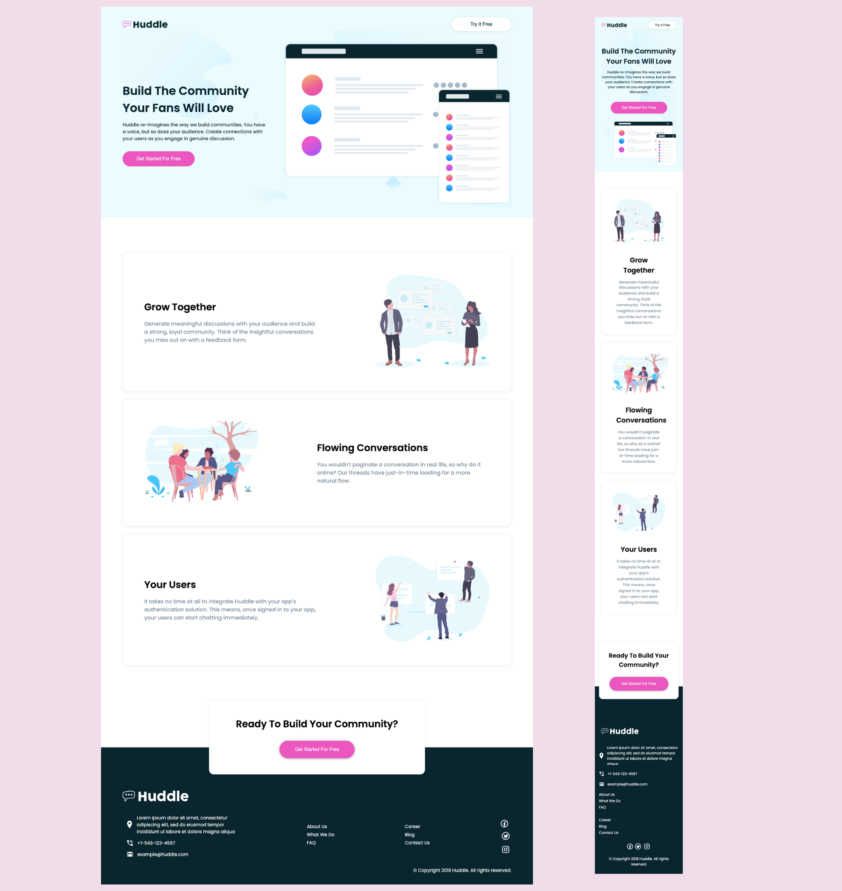

# Frontend Mentor - Huddle landing page with alternating feature blocks solution

This is a solution to the [Huddle landing page with alternating feature blocks challenge on Frontend Mentor](https://www.frontendmentor.io/challenges/huddle-landing-page-with-alternating-feature-blocks-5ca5f5981e82137ec91a5100). Frontend Mentor challenges help you improve your coding skills by building realistic projects. 

## Table of contents

- [Overview](#overview)
  - [The challenge](#the-challenge)
  - [Screenshot](#screenshot)
  - [Links](#links)
- [My process](#my-process)
  - [Built with](#built-with)
  - [What I learned](#what-i-learned)
  - [Continued development](#continued-development)
- [Author](#author)
- [Acknowledgments](#acknowledgments)


## Overview

### The challenge

Users should be able to:

- View the optimal layout for the site depending on their device's screen size
- See hover states for all interactive elements on the page

### Screenshot



### Links

- Solution URL: [Click here to view my solution](https://www.frontendmentor.io/solutions/responsive-huddle-landing-page-d9MwU29DRv)
- Live Site URL: [Click here to visit the live site](https://omowunmikamil.github.io/huddle-landing-page/)

## My process

### Built with

- Semantic HTML5 markup
- CSS custom properties
- Flexbox
- Mobile-first workflow

### What I learned

I learned how to make my webpage responsive on all sectionises screen type. I also learned how to use flexbox to align items in a row or column. I also learned how to use media queries to make my webpage responsive on all screen sizes.
```html
<section class="container">
  <section class="content">
    <h1>Some HTML code I'm proud of</h1>
  </section>
</section>
```
```css
.container {
  display: flex;
  justify-content: center;
  align-items: center;
}

#header {
  background-color: var(--very-pale-cyan);
}

button {
    background-color: #fff;
    color: var(--very-dark-cyan);
    font-size: 16px;
    width: 200px;
    padding: 14px 20px;
    border-radius: 50px;
    border: none;
    box-shadow: 0 1px 8px 0 rgba(0, 0, 0, 0.1);
}

.component {
    display: flex;
    justify-content: space-between;
    align-items: center;
    border-radius: 16px;
    box-shadow: 0 1px 8px 0 rgba(0, 0, 0, 0.1);
    padding: 4em;
    margin: 1.5em 0;
}

@media (max-width: 768px) {
    .component {
        flex-direction: column;
    }
}
```

### Continued development

I will continue to learn more about flexbox and grid. I will also learn more about media queries and how to make my webpage responsive on all screen sizes. I will also learn more about CSS custom properties and how to use them in my projects.

## Author

- Website - [Visit my Portfolio Website](https://omowunmikamil.tech)
- Frontend Mentor - [Omowunmi Kamiludeen](https://www.frontendmentor.io/profile/Omowunmikamil)
- Twitter - [Browser_Nerd](https://www.twitter.com/@Browser_Nerd)

## Acknowledgments

I would like to thank Frontend Mentor for providing me with this challenge.
